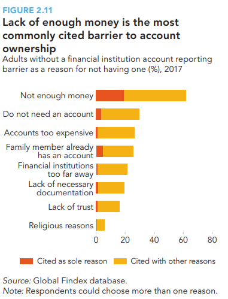
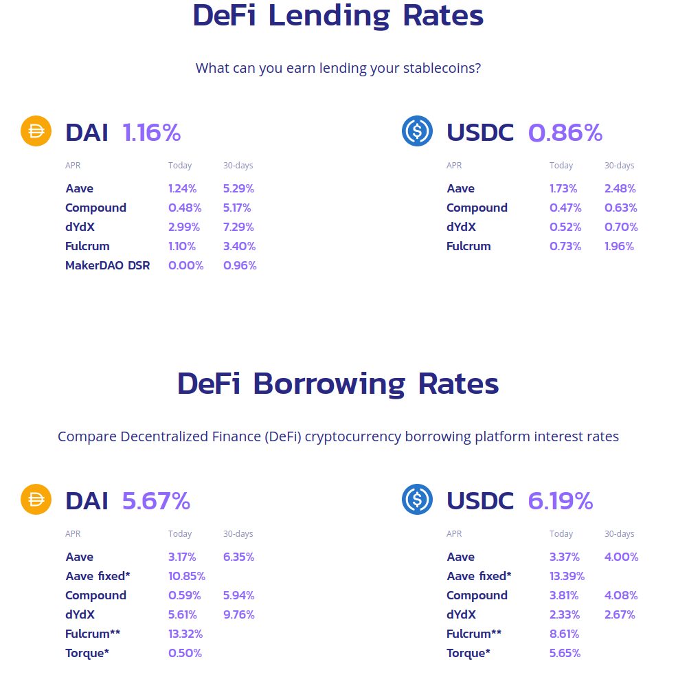
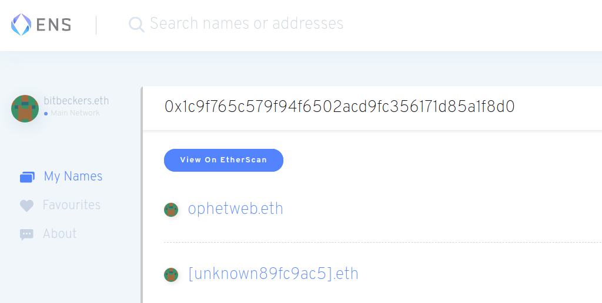
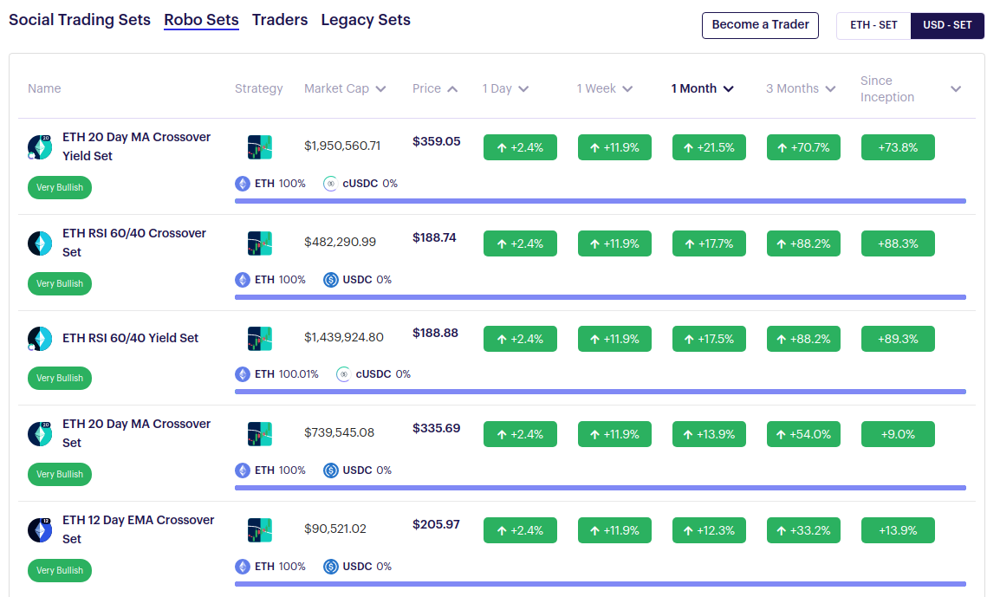
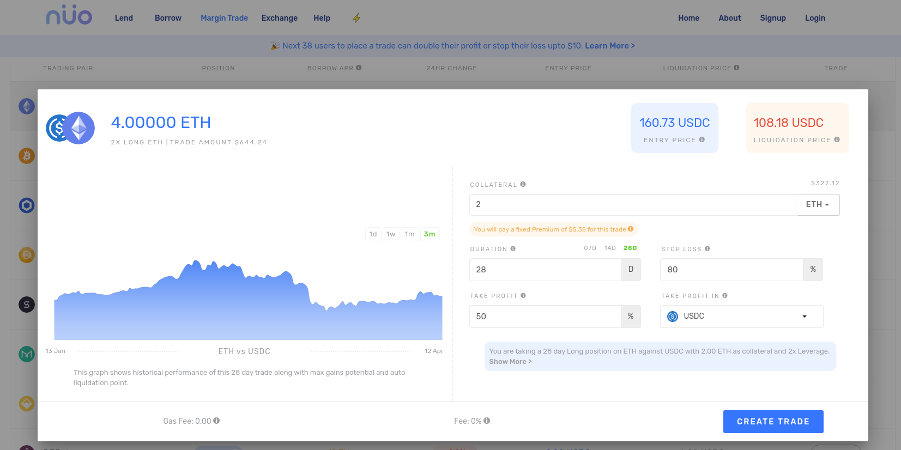
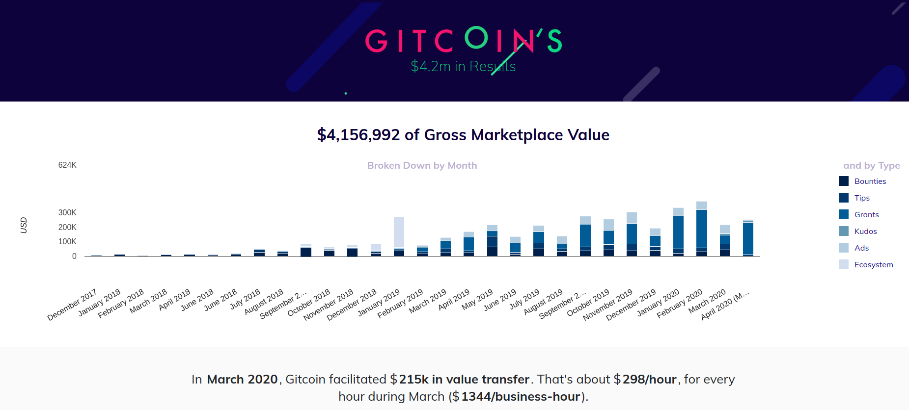
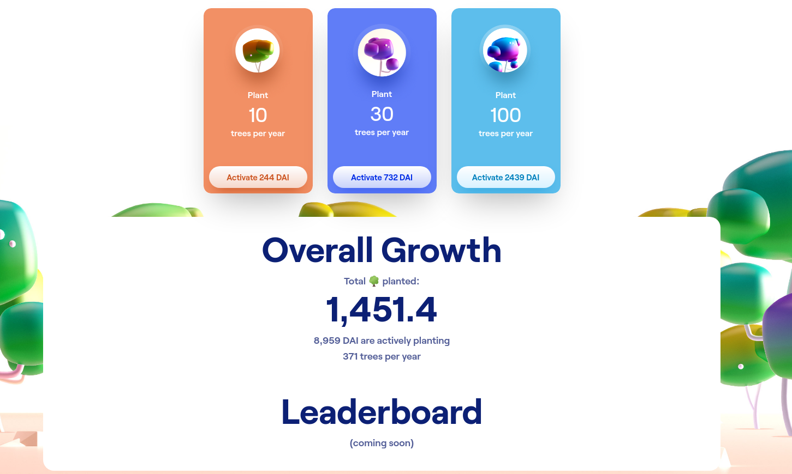
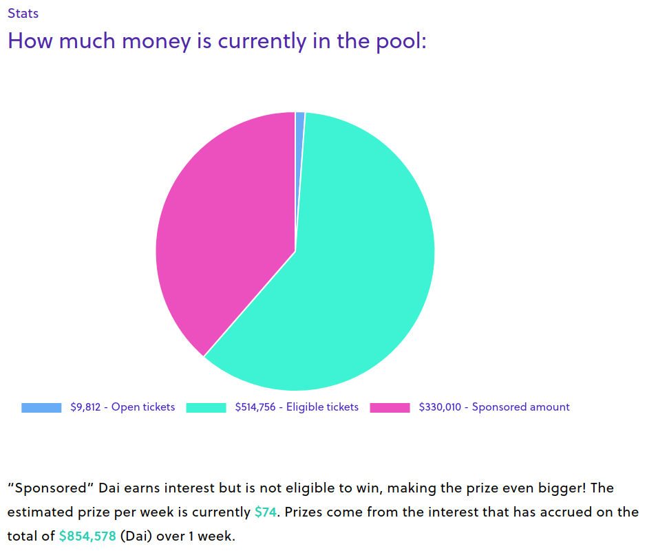

# Decentralized finance on Ethereum

---

# Traditional finance offers

* Access to liquidity
* Security of funds
* Loans
* Interest on deposits
* Oppertunities for investing

---

> Beginning in 2012, an international investigation into the London Interbank Offered Rate, or Libor, revealed a widespread plot by multiple banks—notably Deutsche Bank, Barclays, UBS, Rabobank, and the Royal Bank of Scotland— __to manipulate these interest rates for profit__ starting as far back as 2003.

*[Understanding Libor Scandal](https://www.cfr.org/backgrounder/understanding-libor-scandal)*

---

> Under EU rules, deposit guarantee schemes:
> * protect depositors' savings by __guaranteeing deposits of up to €100,000__ 
> * help __prevent the mass withdrawal of deposits__ in the case of bank failure, which can create financial instability

*[Deposit guarantee schemes](https://ec.europa.eu/info/business-economy-euro/banking-and-finance/financial-supervision-and-risk-management/managing-risks-banks-and-financial-institutions/deposit-guarantee-schemes_en)*

---

> Globally, about __1.7 billion adults remain unbanked__—without an account at a
financial institution or through a mobile money provider. In 2014 that number
was 2 billion.

*[Findex report 2017 - Chapter 2](https://globalfindex.worldbank.org/sites/globalfindex/files/chapters/2017%20Findex%20full%20report_chapter2.pdf)*

---

> Trading on the New York Stock Exchange was __temporarily halted for the fourth time in two weeks__ after the S&P 500 index plunged 7%. The S&P 500 fell 5% for the day.

[NPR](https://text.npr.org/s.php?sId=817650272)


---

# Can we do better?

---

# Decentralized finance

* Trustless
* Open Source & Transparent
* Permissionless
* Censorship resistant
* User sovereignty

*[Defi North Star](https://defiwatch.net/defi-values/the-defi-north-star)*

---

> Ethereum is a global, open-source platform for decentralized applications.
[Ethereum.org](https://ethereum.org/)


---

> A smart contract is a __computer protocol__ intended to digitally facilitate, verify, or enforce the negotiation or performance of a contract. Smart contracts allow the performance of __credible transactions without third parties__. These transactions are __trackable__ and __irreversible__.

[Smart Contract](https://en.wikipedia.org/wiki/Smart_contract)

---

seed phrase
```awake law square nose float nothing truly divorce bring edge photo stage```

returns BIP32 key

```xprv9zvLoeXs9gAGViFcqUysSEpk9y1ki6WFgs8uzb5ATVS9tEQr6yvJr2kHMzSqTUsPvZ4B4MCZQbzp26RxT43uZR9FcAmVHHB2LZL58EGVLq6```

---

public key from BIP32 key

```02305562b2553453c95f37b51bca7b585f6c67c2f0e973d77b8ad8e54012341177```

private key from BIP32 key

```L4HsjbUgyEap34F2YPHKUUFUTnXNKvywVMoEe7CRmEWzaMPXFW3s```

---

# Decentralized finance

Smart contracts on Ethereum *can* be/provide:

* Trustless
* Open Source & Transparent
* Permissionless
* Censorship resistant
* User sovereignty

*[DeFi North Star](https://defiwatch.net/defi-values/the-defi-north-star)*

---

product marketplace


---

money LEGOs


---

# Infrastructure

MakerDAO (MKR/DAI)
Kyber (KNC)

---

adding stability (MKR / DAI)
[An Elegant Relationship](https://medium.com/scalar-capital/an-elegant-relationship-dai-eth-mkr-4e4d5e69590)


---

adding liquidity (KNC)


[Kyber Network](https://kyber.network/)

---

# Borrowing <> Lending

MakerDAO (MKR/DAI)
DyDx (ETH/DAI/USDC)
Compound (cTokens)
Nuo (many)
...

---

borrow and lending rates against stablecoins (~$1)
[DeFi Rates](https://defiprime.com/defi-rates)



---

# Daily banking

Current account
Savings
IBAN

---
Current account
_Monolith_


---
Savings
_DAI Savings Rate_
[DSR](https://blog.makerdao.com/why-the-dai-savings-rate-is-a-game-changer-for-the-defi-ecosystem-and-beyond/)


---
IBAN

bitbeckers.eth
_ENS_


---

# Investing

Stocks
(Leveraged) Trading

---

Automated token trading - TokenSets



---

Leveraged trading:

DyDx, Nuo, Fulcrum, ...



---

# Funding

* Grants: GitCoin
* Monetization: Unlock protocol
* Payroll: Sablier
* Charity: rTrees

---



---



---

# Decentralized finance offers

* Access to liquidity
* Security of funds
* Loans
* Interest on deposits
* Oppertunities for investing

---

While providing services that are

* Trustless
* Open Source & Transparent
* Permissionless
* Censorship resistant
* User sovereignty

*[DeFi North Star](https://defiwatch.net/defi-values/the-defi-north-star)*

---

abstraction towards the end user
[Digital Finance Stack](https://medium.com/pov-crypto/ethereum-the-digital-finance-stack-4ba988c6c14b)


---

# ?

---

# Demo wallets

---
Coinbase - Fiat to crypto

---
Argent - Banking, easy recovery and limits

---
MetaMask - Browser plugin

---
Ledger - Cold storage

---
<!-- backgroundImage: none -->
<!-- color: black -->

# Resources and fun readings
[Chris Blec](https://defiwatch.net/)
[David Hoffman](https://medium.com/@TrustlessState)
[EthHub](https://docs.ethhub.io/)
[Building with money LEGOs](https://medium.com/totle/building-with-money-legos-ab63a58ae764)
[Visualizing DeFi](https://medium.com/wtf-dao/visualizing-defi-the-evolution-of-a-connected-system-cae60d26f10c)

---

# Market crash March 2020

[Maker](https://blog.makerdao.com/the-market-collapse-of-march-12-2020-how-it-impacted-makerdao/)

---

# Gambling (off-topic)

Pool Together
Augur

---



---

# Oracles (off-topic)

MakerDAO
Augur
ChainLink

---

# Network effect

---


[Visualizing DeFi](https://medium.com/wtf-dao/visualizing-defi-the-evolution-of-a-connected-system-cae60d26f10c)

---


---


---